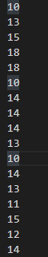

#Calculador automático da media de notas

_Pode ser mais explorado mais tarde_

Para saber a sua media, vá à pasta files e lá está o ficheiro `notas.txt`. Abra-o escreve o numero da nota linha por linha.

A linha parecerá algo como isto 
